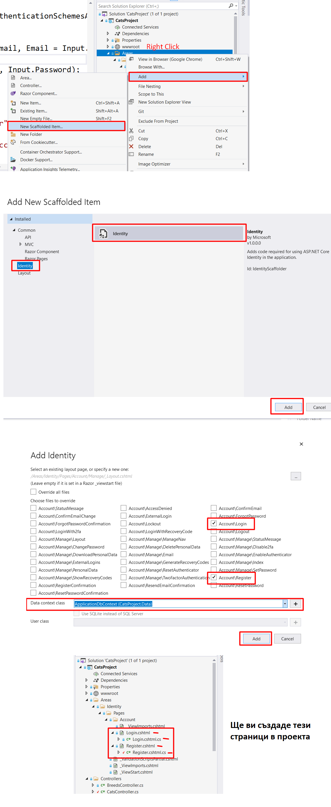
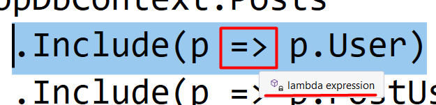
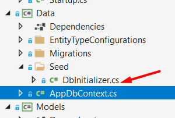
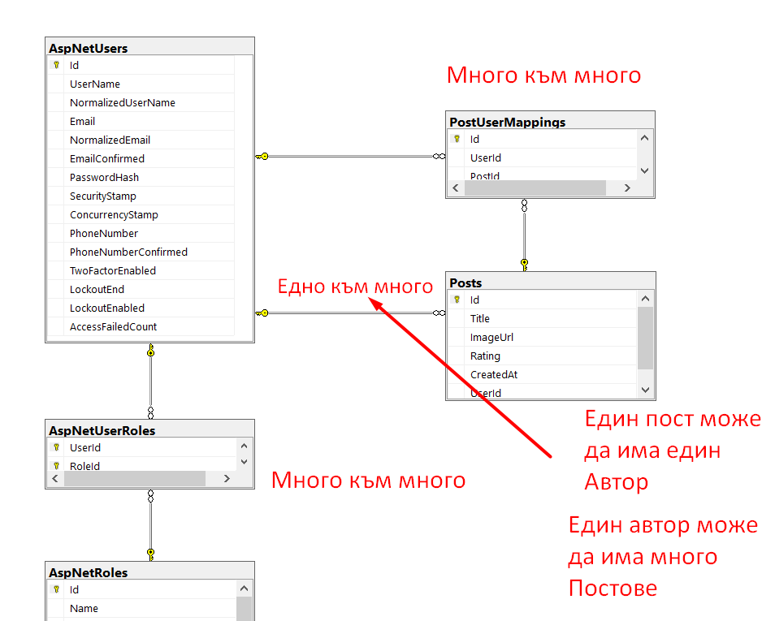
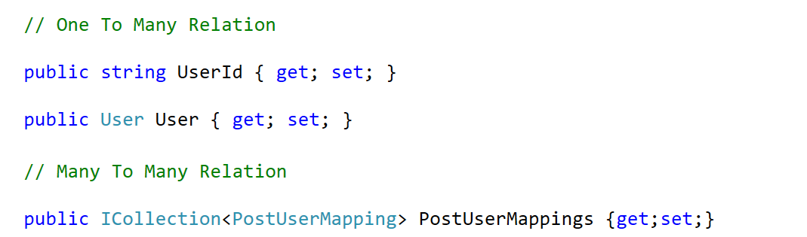
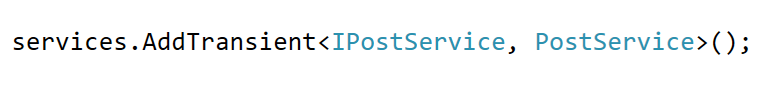
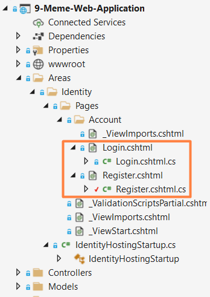

# Repository for Software Engineering

## Добавяне на Login и Register страници

## Примерни Въпроси

### Какво е Entity в C#?
- Клас, който представлява таблица от базата и нейн ред е
property.

### Какво представлява lambda expression? (=> - lambda expression)
- .Include( cat => cat.Breed)

### Какво е MVC?

- Model-View-Controller (кое какво прави)

### Каква е ролята на DbContext класът във вашият проект?

- Връзка на .Net проекта ни с базата.

### Какви видове релации има във вашите проекте?

### Коя е началната точка на проекта?

- Началната точка на проекта е **Program.cs**, и той извиква вече **StartUp.cs** (ако има).

### За какво се ползват Repository-та?

- Repository-то е вид **Design Pattern**. Правене на заявки към базата. (Извиква DbContext)

DbContext -> Repository -> Service -> Controller

### За какво служат Service-ите във вашият проект?

- За да нямаме големи контролери с много код, ние разбиваме нашият c# код на други файлове. Със сървисите, проектът ни е по-четлив и по приятен.

- Може да искаме някаква логика в проекта да има singleton, transient, scoped функционалности.

- Това се пише в **StartUp.cs**.

### Какви видове сървиси има?

**Transient** objects are always different; a new instance is provided to every controller and every service.

**Scoped** objects are the same within a request, but different across different requests.

**Singleton** objects are the same for every object and every request.

### За какво се ползват въпросителният знак, след една променлива?

- cat? - стойността на променливата може да е null

### Къде се намира Login и Register страниците?

- Ако е **Scaffold**-нато identity

- Ако не е **Scaffold**-нато identity
Страниците като код, не се намират никъде. Използва се Identity, което автоматично генерира страниците.

### Какви видове цикли се използват при работа с база данни?

- **foreach(var el in elements)**

### За какво се ползва Seed(DbInitalizer)?

- Mockup данни, с които популираме базата при стартиране.

### Кое е по-бързо IEnumerable или HashSet?

- HashSet (2-пъти по-малко като памет)?